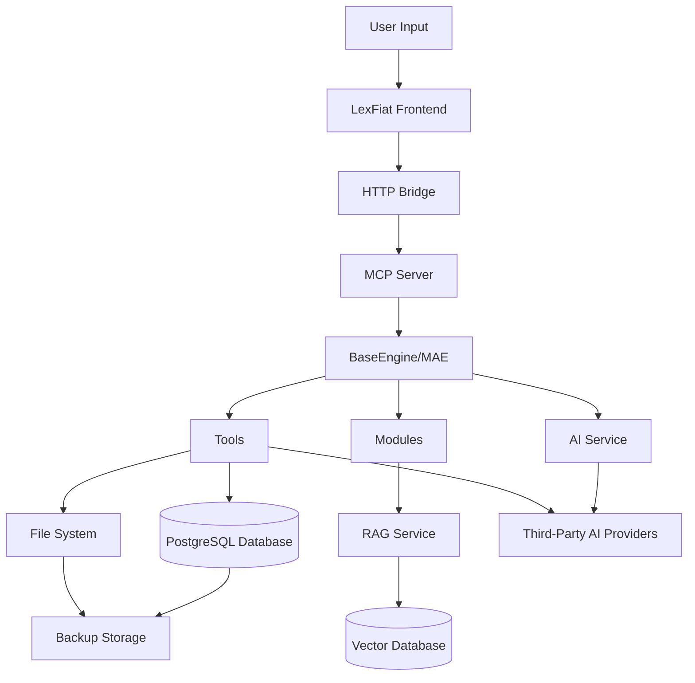
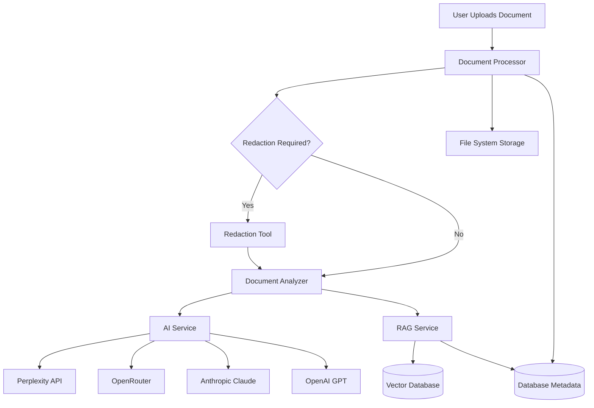
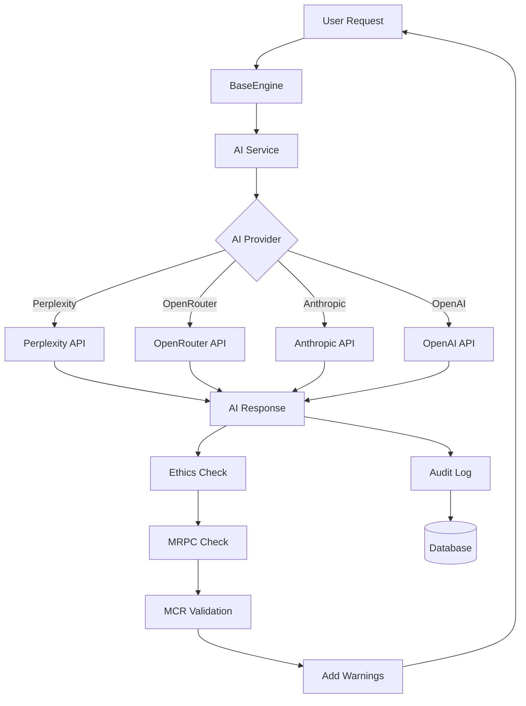
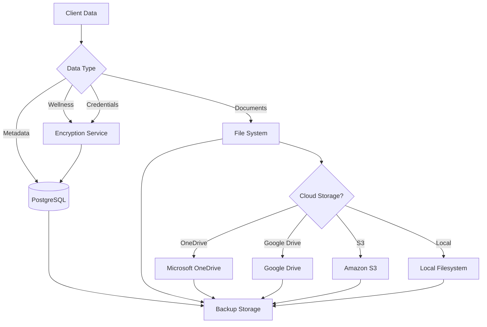
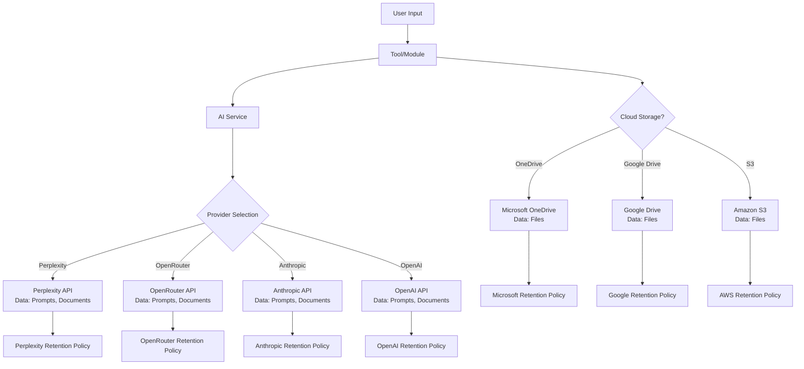
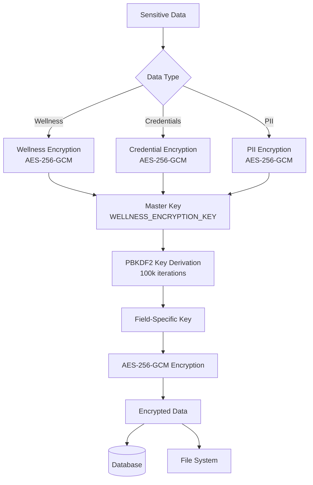
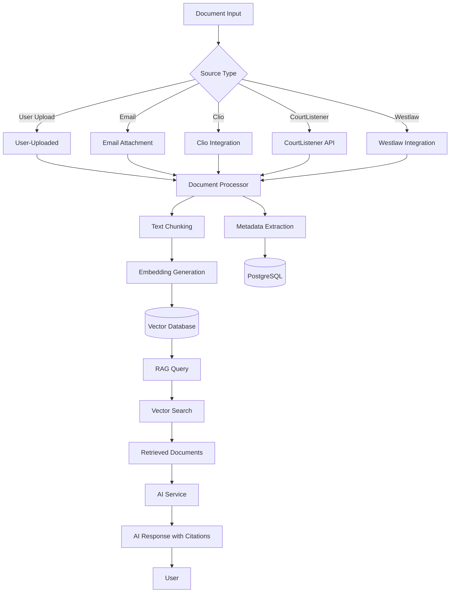
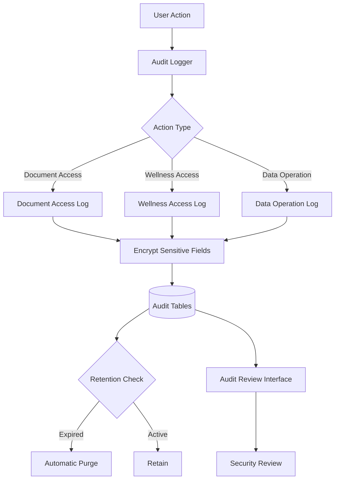

# Data Flow Diagram

**Date:** 2025-12-28  
**Status:** Active  
**Purpose:** Document client data flow through the Cyrano system, including processing, storage, transmission, and third-party integrations

---

## Overview

This document provides data flow diagrams and descriptions for how client data flows through the Cyrano legal AI system, from input to storage to third-party processing.

---

## High-Level Data Flow

---

## Detailed Data Flow: Document Processing

---

## Detailed Data Flow: AI-Generated Content

---

## Data Storage Flow

---

## Third-Party Data Sharing Flow

---

## Data Encryption Flow

---

## RAG Pipeline Data Flow

---

## Audit Logging Flow

---

## Data Transmission Security

### In Transit Encryption

**All Data Transmission:**
- HTTPS/TLS for HTTP Bridge
- TLS for database connections
- TLS for API calls to third parties
- Encrypted OAuth token transmission

**Implementation:**
- HTTP Bridge: Express with HTTPS support
- Database: TLS connection strings
- API Calls: HTTPS endpoints
- OAuth: TLS-protected OAuth flows

---

## Data Processing Locations

### Local Processing

**Location:** User's local machine or server

**Data Processed:**
- Document processing (redaction, analysis)
- RAG query processing
- Workflow execution
- Encryption/decryption

**Third-Party Access:** None (local processing only)

---

### Cloud Processing

**Location:** Third-party AI providers

**Data Processed:**
- AI-generated content
- Document analysis
- Legal research queries

**Third-Party Access:**
- Perplexity AI
- OpenRouter (routes to underlying providers)
- Anthropic Claude
- OpenAI GPT
- Google Gemini

**Data Shared:**
- User prompts
- Document content
- Query text

---

## Data Retention by Third Parties

### AI Providers

**Perplexity:**
- Retention: Per Perplexity privacy policy
- BAA: Not available
- Use: Research and analysis only

**OpenRouter:**
- Retention: Per underlying provider policies
- BAA: Not available
- Use: Research and analysis only

**Anthropic:**
- Retention: Per Anthropic privacy policy
- BAA: Not available (as of 2025-12-28)
- Use: Document generation and analysis

**OpenAI:**
- Retention: Per OpenAI privacy policy
- BAA: Not available (as of 2025-12-28)
- Use: Document generation and analysis

**Google:**
- Retention: Per Google privacy policy
- BAA: Not available (as of 2025-12-28)
- Use: Document generation and analysis

---

## Recommendations

### Data Minimization

1. **Redaction Before AI Processing:**
   - Redact client confidential information before sending to AI providers
   - Use redaction tool before document analysis
   - Minimize data shared with third parties

2. **Local Processing:**
   - Process sensitive documents locally when possible
   - Use RAG for document retrieval (local processing)
   - Minimize third-party AI usage for confidential work

3. **Encryption:**
   - Encrypt all data before transmission
   - Encrypt all data at rest
   - Use end-to-end encryption for third-party sharing

---

## Compliance Considerations

### Attorney-Client Privilege

**Protection Measures:**
- Encrypt sensitive data at rest
- Minimize third-party data sharing
- Use redaction before AI processing
- Document all data access

**Risks:**
- Third-party AI providers may retain data
- No BAA protection for most providers
- Attorney-client privilege may be waived

**Recommendations:**
- Obtain client consent for third-party AI usage
- Use AI only for non-confidential work
- Review AI provider privacy policies

---

### HIPAA Compliance

**Protected Health Information (PHI):**
- Wellness journal entries: Encrypted
- Health-related data: Encrypted
- Access logging: Implemented

**Compliance Measures:**
- Encryption at rest for PHI
- Access controls implemented
- Audit logging implemented
- Retention policies defined

**Gaps:**
- No BAA with AI providers
- No BAA with most cloud storage providers
- Retention enforcement incomplete

---

## Next Steps

1. **Complete Data Flow Documentation:**
   - Document all data flows
   - Document all third-party integrations
   - Document all data retention policies

2. **Implement Enhanced Security:**
   - End-to-end encryption for third-party sharing
   - Key management service
   - Enhanced audit logging

3. **Negotiate BAAs:**
   - Negotiate BAAs with AI providers
   - Negotiate BAAs with cloud storage providers
   - Document BAA status

---

**Last Updated:** 2025-12-28
